# 📊 Architektur-Diagramme - Visual Architecture

## 1. System Architecture Diagram

```mermaid
graph TB
    subgraph Client["🖥️ Frontend Layer (React + Vite)"]
        A["Pages<br/>(Home, Login, Register)"]
        B["Components<br/>(MainLayout, Toast)"]
        C["Utils<br/>(authUtils, Validation)"]
        D["State<br/>(useState, localStorage)"]
    end
    
    subgraph Network["🌐 Network"]
        E["REST API<br/>(HTTP/JSON)"]
    end
    
    subgraph Server["⚙️ Backend Layer (Express.js)"]
        F["Routes<br/>(POST, GET)"]
        G["Middleware<br/>(CORS, Auth, Parser)"]
        H["Services<br/>(Auth, Validation, User)"]
        I["Models<br/>(Database Queries)"]
    end
    
    subgraph Database["💾 Data Layer (PostgreSQL)"]
        J["Table: users<br/>(id, email, password_hash)"]
    end
    
    A --> C
    C --> D
    D --> E
    E --> F
    F --> G
    G --> H
    H --> I
    I --> J
    J --> I
    I --> H
    H --> G
    G --> F
    F --> E
    E --> C
    C --> B
    B --> A
```

---

## 2. Frontend Component Architecture

---

## 3. Backend Request Processing Flow

---

## 4. Authentication Flow (Detailed)

```mermaid
graph LR
    A["1. User Input<br/>(Email, Password)"]
    B["2. Client Validation<br/>(Email Format, Length)"]
    C["3. API Request<br/>(POST /api/login)"]
    D["4. Server Validation<br/>(Repeat Validation)"]
    E["5. Find User in DB<br/>(SELECT by email)"]
    F["6. Compare Password<br/>(bcrypt.compare)"]
    G["7. Match?"]
    H["✓ Generate JWT<br/>(Sign Token)"]
    I["✗ Return 401<br/>(Invalid)"]
    J["8. Send Token<br/>(200 + token)"]
    K["9. Save Token<br/>(localStorage)"]
    L["10. Authenticated<br/>(User Logged In)"]
    
    A --> B
    B --> C
    C --> D
    D --> E
    E --> F
    F --> G
    G -->|Match| H
    G -->|No Match| I
    H --> J
    I --> J
    J --> K
    K --> L
```

---

## 5. Data Model Diagram

---

## 6. Component State Management

---

## 7. API Endpoint Hierarchy

```mermaid
graph TB
    API["🔑 /api"]
    
    API --> AUTH["🔐 /auth"]
    API --> USER["👤 /users"]
    
    AUTH --> LOGIN["POST /api/login<br/>{email, password}"]
    AUTH --> REGISTER["POST /api/register<br/>{first_name, last_name, email, password, role}"]
    AUTH --> VERIFY["POST /api/auth/verify<br/>(Protected)"]
    
    USER --> LIST["GET /api/users<br/>(Protected)<br/>Returns: User[]"]
    
    LOGIN --> AUTH_SUCCESS["✓ 200 OK<br/>{token, user}"]
    LOGIN --> AUTH_ERROR["✗ 401 Unauthorized<br/>{error}"]
    
    REGISTER --> REG_SUCCESS["✓ 201 Created<br/>{message, token, user}"]
    REGISTER --> REG_ERROR["✗ 400 Bad Request<br/>{error}"]
    
    LIST --> LIST_SUCCESS["✓ 200 OK<br/>User[]"]
    LIST --> LIST_ERROR["✗ 401 Unauthorized<br/>{error}"]
    
    VERIFY --> VER_SUCCESS["✓ 200 OK<br/>{valid, user}"]
    VERIFY --> VER_ERROR["✗ 401 Unauthorized"]
```

---

## 8. Security Layers Visualization

```mermaid
graph LR
    A["User Input"]
    
    A --> L1["Layer 1: Input Validation<br/>(Frontend)"]
    L1 --> L2["Layer 2: Format Check<br/>(Backend)"]
    L2 --> L3["Layer 3: Business Logic<br/>(Services)"]
    L3 --> L4["Layer 4: Authentication<br/>(JWT Middleware)"]
    L4 --> L5["Layer 5: Database<br/>(Queries)"]
    L5 --> L6["Layer 6: Encryption<br/>(bcrypt)"]
    
    L6 --> B["✓ Secure<br/>Storage"]
    L6 --> C["✗ Rejected<br/>Error"]
```

---

## 9. Deployment Architecture (Future)

```mermaid
graph TB
    subgraph "Internet"
        USER["👥 Users"]
    end
    
    subgraph "CDN / Hosting"
        CDN["📦 CDN<br/>(Static React Build)"]
    end
    
    subgraph "Cloud Infrastructure"
        LB["⚖️ Load Balancer<br/>(Nginx/AWS)"]
        
        subgraph "Backend Cluster"
            API1["🔗 API Server 1"]
            API2["🔗 API Server 2"]
            API3["🔗 API Server 3"]
        end
        
        subgraph "Cache Layer"
            REDIS["💾 Redis Cache"]
        end
        
        subgraph "Database Cluster"
            DBPRIM["🗄️ PostgreSQL Primary"]
            DBREP1["🗄️ PostgreSQL Replica 1"]
            DBREP2["🗄️ PostgreSQL Replica 2"]
        end
        
        subgraph "Services"
            LOGS["📝 Logging (ELK)"]
            MONITOR["📊 Monitoring (Prometheus)"]
            QUEUE["📨 Message Queue (RabbitMQ)"]
        end
    end
    
    USER --> CDN
    CDN --> LB
    LB --> API1
    LB --> API2
    LB --> API3
    
    API1 --> REDIS
    API2 --> REDIS
    API3 --> REDIS
    
    REDIS --> DBPRIM
    DBPRIM --> DBREP1
    DBPRIM --> DBREP2
    
    API1 --> LOGS
    API2 --> LOGS
    API3 --> LOGS
    
    LOGS --> MONITOR
    
    API1 --> QUEUE
    API2 --> QUEUE
    API3 --> QUEUE
```

---

## 10. Error Handling Flow

---

## 11. Token Lifecycle

---

## 12. Scalability Timeline

```mermaid
graph LR
    A["🔷 Phase 1<br/>MVP (Heute)<br/>Single Server"]
    B["🔶 Phase 2<br/>Wachstum<br/>Horizontal Scaling"]
    C["🔴 Phase 3<br/>Microservices<br/>Service Separation"]
    D["⭕ Phase 4<br/>Enterprise<br/>Multi-Region"]
    
    A --> B
    B --> C
    C --> D
    
    A --> A_DESC["• Vite Dev Server<br/>• Express Single<br/>• PostgreSQL Single"]
    B --> B_DESC["• Docker<br/>• Kubernetes<br/>• Load Balancer<br/>• Redis Cache"]
    C --> C_DESC["• Auth Service<br/>• User Service<br/>• Notification<br/>• Event Bus"]
    D --> D_DESC["• Multi-Region<br/>• CDN<br/>• DynamoDB<br/>• Event Streaming"]
```

---

## Legende

| Symbol | Bedeutung |
|--------|-----------|
| 🖥️ | Frontend/Client |
| ⚙️ | Backend/Server |
| 💾 | Datenbank/Storage |
| 🌐 | Netzwerk |
| 🔐 | Sicherheit/Auth |
| 📊 | Monitoring/Analytics |
| ✓ | Erfolg |
| ✗ | Fehler |
